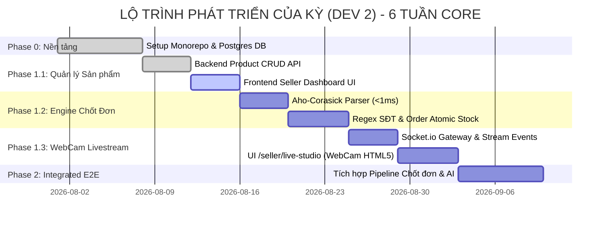
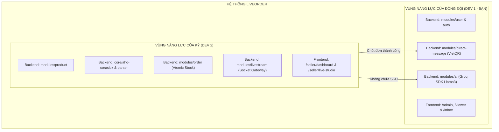
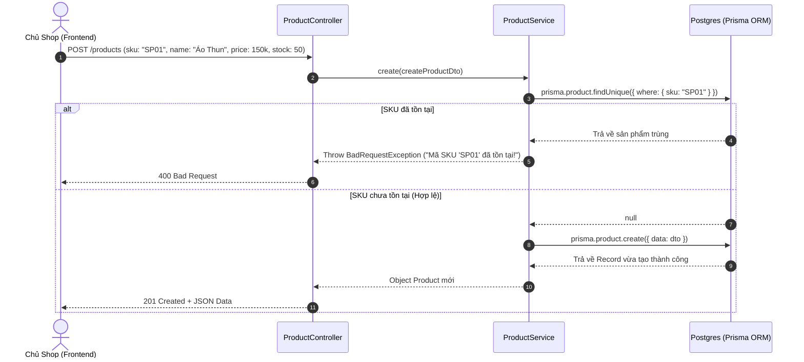
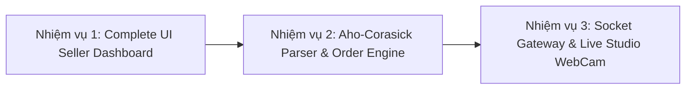

# 🚀 CẨM NANG HƯỚNG DẪN, KẾ HOẠCH & TIẾN ĐỘ THỰC THI (DÀNH RIÊNG CHO KỲ - DEV 2)

> **Dự án:** LiveOrder - Real-time Live-Commerce Engine Chốt Đơn Tự Động  
> **Thành viên:** Kỳ (Dev 2)  
> **Phân công trách nhiệm:** Backend `product`, `parser` (Aho-Corasick), `order` (Atomic Stock), `livestream` (Socket.io Gateway) & Frontend `/seller/` (Seller Dashboard & WebCam Live Studio).  
> **Mục đích file này:** Cung cấp lộ trình trực quan, giải thích chi tiết code đã làm, cách test ngay thấy ngay kết quả, và kịch bản hướng dẫn cho AI Agent trong mọi phiên làm việc mới.

---

## 🗺️ 1. SƠ ĐỒ LỘ TRÌNH & BẢN ĐỒ TIẾN ĐỘ DÀNH RIÊNG CHO KỲ

### 📊 Sơ đồ Timeline Phát triển (Kỳ - Dev 2)



---

### 📋 Bảng Check-list Tiến Độ Chi Tiết của Kỳ

| STT | Hạng mục / Tính năng | Mô tả công việc | File liên quan | Trạng thái |
| :---: | :--- | :--- | :--- | :---: |
| **01** | **Backend Product API** | CRUD Sản phẩm, Kiểm tra trùng SKU, Query theo Seller | `apps/backend/src/modules/product/*` | ✅ **HOÀN THÀNH** |
| **02** | **Frontend Seller Dashboard** | Màn hình `/seller/dashboard`: Danh sách SP & Form Tạo SP | `apps/frontend/src/pages/seller/SellerDashboard.tsx` | 🔄 **ĐANG THỰC HIỆN** |
| **03** | **Thuật toán Aho-Corasick** | Xây dựng cây Automaton bóc SKU từ Comment trong < 1ms | `apps/backend/src/core/aho-corasick/*` | ⏳ **CHƯA BẮT ĐẦU** |
| **04** | **Parser SĐT & Comment** | Tách SĐT bằng Regex + Tách SKU | `apps/backend/src/modules/parser/*` | ⏳ **CHƯA BẮT ĐẦU** |
| **05** | **Order Engine (Atomic Stock)**| Tạo đơn hàng & Trừ kho Postgres an toàn (`stock >= qty`) | `apps/backend/src/modules/order/*` | ⏳ **CHƯA BẮT ĐẦU** |
| **06** | **Livestream Socket Gateway** | Real-time WebSocket room cho từng phiên Livestream | `apps/backend/src/modules/livestream/*` | ⏳ **CHƯA BẮT ĐẦU** |
| **07** | **Live Studio WebCam UI** | Màn hình `/seller/live-studio`: Bật WebCam + Nổ đơn Pop-up | `apps/frontend/src/pages/seller/LiveStudio.tsx` | ⏳ **CHƯA BẮT ĐẦU** |

*Ký hiệu: ✅ Hoàn thành | 🔄 Đang thực hiện | ⏳ Chưa bắt đầu*

---

## 📐 2. SƠ ĐỒ TỔNG THỂ KIẾN TRÚC & PHÂN CHIA QUYỀN HẠN

Để tránh xung đột Git (Merge Conflict), dự án được chia làm **2 luồng song song**. Dưới đây là ranh giới vùng làm việc của Kỳ:



---

## 🔍 3. GIẢI THÍCH CHI TIẾT NHỮNG ĐOẠN CODE KỲ VỪA VIẾT

Kỳ đã viết xong module Backend Product (`apps/backend/src/modules/product/`). Dưới đây là bản giải thích trực quan:



### Các file Kỳ đã hoàn thành:
1. **`schema.prisma` (Model Product):**
   - Định nghĩa `sku` (Unique - Không được trùng), `name`, `price`, `stock` (Số lượng tồn kho), `sellerId` (Mã chủ shop).
2. **`CreateProductDto` & `UpdateProductDto`:**
   - Đảm bảo dữ liệu gửi lên phải đúng kiểu dữ liệu (String, Number).
3. **`product.service.ts`:**
   - `create`: Kiểm tra trùng SKU trước khi insert DB.
   - `findAllBySeller`: Lấy tất cả sản phẩm của Seller theo `sellerId`, sắp xếp mới nhất lên đầu.
   - `findOne`, `update`, `remove`: Các hàm CRUD xem/sửa/xóa sản phẩm theo ID.
4. **`product.controller.ts`:**
   - Khai báo các API Endpoints: `POST /products`, `GET /products?sellerId=...`, `GET /products/:id`, `PATCH /products/:id`, `DELETE /products/:id`.

---

## 🧪 4. HƯỚNG DẪN TEST NGAY ĐỂ THẤY NGAY THÀNH QUẢ

Kỳ hãy mở Terminal trên VS Code và làm theo 3 bước sau để test xem code mình chạy ra sao:

### ⚙️ BƯỚC 1: Khởi động Database Postgres & Backend NestJS

1. **Khởi động Docker Postgres & Redis (nếu chưa chạy):**
   ```bash
   docker-compose up -d
   ```
2. **Khởi chạy Backend NestJS:**
   ```bash
   npm run dev:backend
   ```
   *(Backend sẽ chạy tại `http://localhost:3001`)*

---

### 📡 BƯỚC 2: Test API Backend bằng file `api.http` hoặc Postman / Curl

Kỳ có thể tạo hoặc bổ sung vào file `api.http` ở thư mục gốc project các đoạn mã sau để test click trực tiếp:

#### 1️⃣ Request: Lấy ID tài khoản Seller mẫu
> *Dữ liệu seed mặc định có sẵn `sellerId`:* `seller-uuid-001`

#### 2️⃣ Request: Tạo Sản Phẩm Mới (POST)
```http
POST http://localhost:3001/products
Content-Type: application/json

{
  "sku": "SP01",
  "name": "Áo Polo Nam Premium",
  "price": 199000,
  "stock": 100,
  "sellerId": "seller-uuid-001"
}
```
** Kết quả mong đợi (201 Created):**
```json
{
  "id": "c1a2b3c4-...",
  "sku": "SP01",
  "name": "Áo Polo Nam Premium",
  "price": 199000,
  "stock": 100,
  "sellerId": "seller-uuid-001",
  "createdAt": "2026-08-12T16:00:00.000Z"
}
```

#### 3️⃣ Request: Test tính năng Chống trùng SKU (Gửi lại mã SKU "SP01")
```http
POST http://localhost:3001/products
Content-Type: application/json

{
  "sku": "SP01",
  "name": "Áo Polo Nam Trùng SKU",
  "price": 150000,
  "stock": 10,
  "sellerId": "seller-uuid-001"
}
```
** Kết quả mong đợi (400 Bad Request):**
```json
{
  "message": "Mã SKU 'SP01' đã tồn tại!",
  "error": "Bad Request",
  "statusCode": 400
}
```

#### 4️⃣ Request: Lấy danh sách sản phẩm của Seller (GET)
```http
GET http://localhost:3001/products?sellerId=seller-uuid-001
```
** Kết quả mong đợi (200 OK):** Trả về mảng danh sách các sản phẩm vừa tạo.

---

### 💻 BƯỚC 3: Khởi động Frontend React & Kiểm tra giao diện

1. **Bật thêm một Terminal mới và chạy Frontend:**
   ```bash
   npm run dev:frontend
   ```
   *(Frontend sẽ chạy tại `http://localhost:5173`)*
2. Access vào URL: `http://localhost:5173/seller/dashboard` để thấy màn hình Seller Dashboard.

---

## 🎯 5. KẾ HOẠCH HƯỚNG DẪN KỲ CÁC BƯỚC TIẾP THEO (NEXT STEPS)

Sau khi hoàn thành Backend Product, Kỳ sẽ lần lượt thực hiện 3 nhiệm vụ trọng tâm sau:



### 📍 Nhiệm vụ 1 (Đang làm): Hoàn thiện Màn hình `/seller/dashboard` (React MUI)
- **Tệp tin:** `apps/frontend/src/pages/seller/SellerDashboard.tsx`
- **Nội dung:**
  1. Tạo bảng hiển thị danh sách sản phẩm (Mã SKU, Tên sản phẩm, Giá bán, Tồn kho).
  2. Tạo Nút "Thêm sản phẩm" mở Dialog/Modal Form để điền: SKU, Tên, Giá, Số lượng.
  3. Gọi API NestJS (`http://localhost:3001/products`) bằng `fetch` hoặc `axios` để thêm & load dữ liệu real-time.

### 📍 Nhiệm vụ 2: Thuật toán Aho-Corasick & Order Engine (Trừ kho Atomic)
- **Tệp tin Backend:** `apps/backend/src/core/aho-corasick/` & `apps/backend/src/modules/order/`
- **Nội dung:**
  1. Xây dựng class `AhoCorasick` nạp danh sách SKU của Seller khi phiên live bắt đầu.
  2. Viết parser bóc tách SKU trong comment (Ví dụ: "Tôi mua 2 cái SP01 sđt 0912345678" -> Bóc ra được `SKU = SP01`, `Phone = 0912345678`).
  3. Viết hàm Order `prisma.product.update({ where: { id, stock: { gte: qty } }, data: { stock: { decrement: qty } } })` để trừ kho an toàn tuyệt đối chống oversell.

### 📍 Nhiệm vụ 3: WebCam Livestream & Live Studio UI
- **Tệp tin:** `apps/backend/src/modules/livestream/` & `apps/frontend/src/pages/seller/LiveStudio.tsx`
- **Nội dung:**
  1. Dùng `navigator.mediaDevices.getUserMedia({ video: true, audio: true })` hiển thị camera trực tiếp trên trình duyệt.
  2. Bật kết nối `Socket.io` lắng nghe event `new_order` để nổ hiệu ứng sound/pop-up chốt đơn ngay trên video Streamer.

---

## 🤖 6. HƯỚNG DẪN BẮT BUỘC DÀNH CHO AI AGENT Ở PHIÊN LÀM VIỆC MỚI

> **CHÚ Ý CHO CÁC AI AGENT KHÁC / PHIÊN LÀM VIỆC MỚI:**  
> Đọc kỹ các quy tắc dưới đây trước khi sinh code hoặc hướng dẫn Kỳ!

### ⛔ Quy tắc 0 (QUAN TRỌNG NHẤT): KHÔNG ĐƯỢC SỬA FILE CODE TRỰC TIẾP
> 🚨 **CẢNH BÁO AI AGENT:**  
> AI **TUYỆT ĐỐI KHÔNG ĐƯỢC** tự ý dùng tool thao tác hoặc thay đổi trực tiếp bất kỳ file code nào (`.ts`, `.tsx`, `.json`, `.css`...) của dự án.  
> AI **CHỈ ĐƯỢC PHÉP**:
> 1. Hướng dẫn chi tiết từng bước cho Kỳ tự làm.
> 2. Giải thích tư duy logic và kiến trúc.
> 3. Cung cấp các đoạn code mẫu (Code Snippet) đầy đủ và rõ ràng ngay trong khung chat.
> 4. Chỉ rõ đường dẫn tệp tin và vị trí dòng code cần sửa để Kỳ tự tay viết/chép code.  
> *(Ngoại lệ: AI chỉ được cập nhật file ghi nhận tiến độ `KY_GUIDE.md` khi Kỳ yêu cầu).*

---

### 🛑 Quy tắc 1: Kiểm Tra Git Workflow Đầu Phiên (BẮT BUỘC)
Mỗi khi bắt đầu một phiên làm việc mới với Kỳ, AI **PHẢI** nhắc Kỳ chạy các lệnh Git sau trước tiên:
1. Check nhánh Git hiện tại:
   ```bash
   git status
   ```
   *(Đảm bảo đang ở nhánh `Ky`)*
2. Kéo code mới nhất từ đồng đội về để không bị trễ code:
   ```bash
   git pull origin main
   ```
   *(Nếu làm trên nhánh `Ky` chung thì run `git pull origin Ky`)*
3. Cập nhật Prisma Client (NẾU đồng đội vừa sửa schema):
   ```bash
   npx prisma generate
   ```
   > ⚠️ **CẢNH BÁO AI:** KHÔNG được bảo Kỳ chạy `npx prisma migrate dev` nếu không sửa schema, vì sẽ ghi đè migration của đồng đội!

---

### 🛡️ Quy tắc 2: Tôn Trọng Ranh Giới Quyền Sở Hữu Code
AI chỉ được phép sửa/thêm code trong các vùng thuộc trách nhiệm của Kỳ:
- ✅ **ĐƯỢC PHÉP SỬA:**
  - Backend: `apps/backend/src/modules/product/`
  - Backend: `apps/backend/src/modules/parser/` & `core/aho-corasick/`
  - Backend: `apps/backend/src/modules/order/`
  - Backend: `apps/backend/src/modules/livestream/`
  - Frontend: `apps/frontend/src/pages/seller/` & `components/product/`, `components/stream/`
- ❌ **TỰỆT ĐỐI KHÔNG SỬA (Vùng của Đồng đội Dev 1):**
  - Backend: `modules/user/`, `modules/ai/`, `modules/direct-message/`
  - Frontend: `pages/admin/`, `pages/viewer/`, `pages/inbox/`

---

### 🧪 Quy tắc 3: Luôn Cho Kỳ Test Ngay Sau Mỗi Tính Năng
- Sau khi viết xong bất kỳ một component hoặc API nào, AI **PHẢI** cung cấp ngay:
  1. Lệnh terminal để test (build/run).
  2. Request mẫu (Curl hoặc HTTP format).
  3. JSON kết quả mong đợi (Expected Result) để Kỳ kiểm chứng ngay lập tức.

---

### 🚀 Quy tắc 4: Quy Trình Push Code Cuối Phiên Làm Việc
Khi hoàn thành xong 1 checklist item, AI hướng dẫn Kỳ đẩy code lên Git trơn tru:
1. **Kiểm tra build sạch (Không có lỗi TypeScript):**
   ```bash
   npm run build:backend
   npm run build:frontend
   ```
2. **Commit & Push:**
   ```bash
   git add .
   git commit -m "feat(seller): completed product management UI for seller"
   git push origin Ky
   ```
3. **Cập nhật lại trạng thái trong file `KY_GUIDE.md` & `progress.md` từ 🔄 thành ✅.**

---

*File tài liệu này được tự động liên kết và đồng bộ với `AGENTS.md` và `plan.md` trong hệ thống LiveOrder.*
